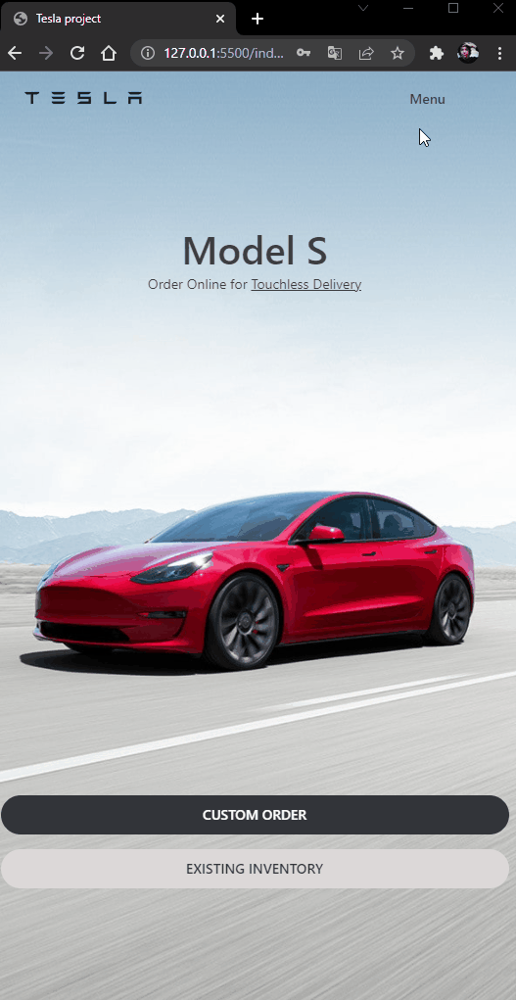

<h1 style="text-align: center;"> Tesla clone </h1>

Recration of official tesla website 

    <a href="#about">About</a> ∙
    <a href="#built-with">Built With</a> ∙
    <a href="#features">Features</a> ∙
    <a href="#shop-model">Shop Model</a> ∙
    <a href="#login-modal">Login Modal</a>

<h1> About </h1>

This is the first project that i ever made after i started to study JavaScript (about 1 month ago),
Tesla clone is a Recreation of the oficial Tesla website, and i made it thinking in get closer as possible to the real one visualy and adding some new features to, like the MODEL SHOP and LOGIN SCREEN. These are some concepts that i covered in the building process:

  - Objects and DOM manipulation;
  - concat, filter, sort and addEventListener;
  - Methods in general:
  - Object and arrays manipulation;
  - Loops;
  - Modulation (import, export);
  - Responsive Layout, pseudo-classes and pseudo-elements in CSS;
  - Trying to Best Practices and Refactoring.

<h1> Built With </h1>

- Javascript;
- CSS;
- HTML;

<h1> Features </h1>

to add more complexity to the project i decided to add some features that aren't include in the original Tesla Website, are some of that:

<h2>Shop Model</h2>

Simulate a shop page in a modal. 

  

<h2>Login Modal</h2>

A feature created to simulate a simple Login screen with some validation.
  
Obs:  
Email: tesla@tesla.com 
Password: iloveelonmusk

 

